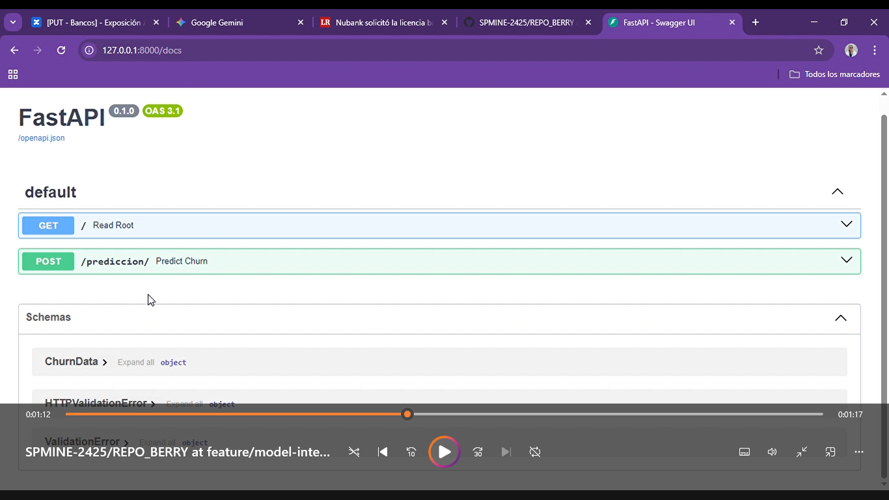
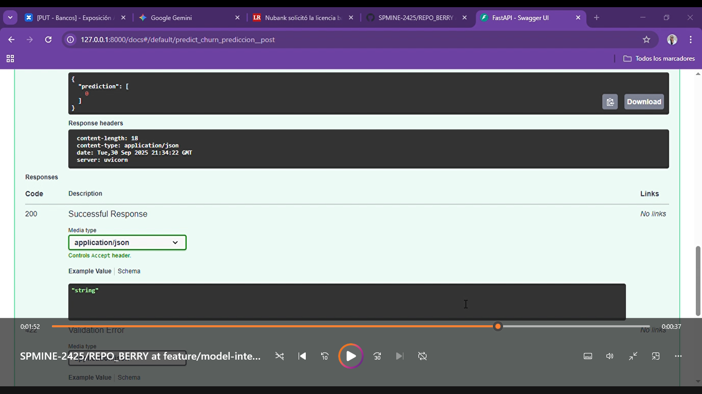
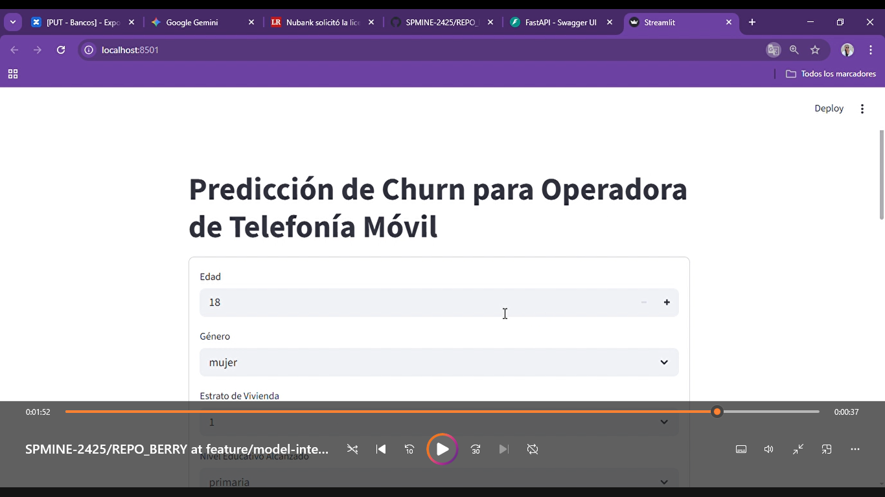
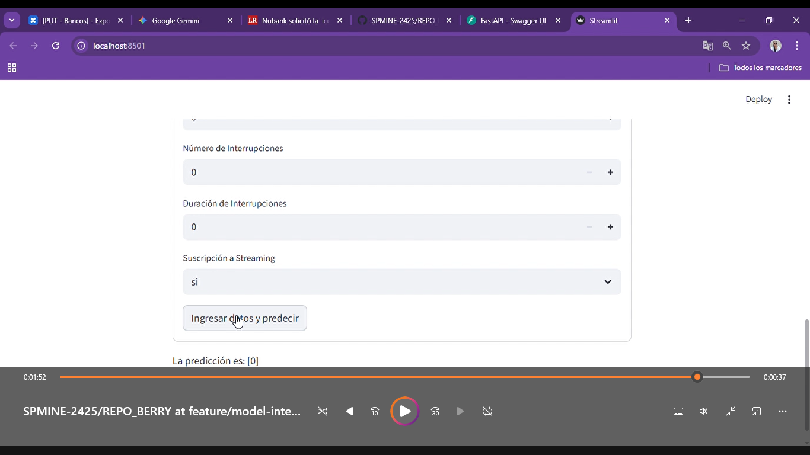

<center>


# Proyecto Final Seminario de Programación
### Maestría en Inteligencia de Negocios - MINE09
#### Echeverry Julián - Berrío Cristina

</center>


##  1. Problema
<div style="text-align: justify;">

La alta competitividad del mercado de telecomunicaciones, dada la posibilidad de portar el número telefónico entre empresas, exige que los operadores de telefonía móvil no solo capten nuevos usuarios, sino que también retengan a los ya existentes.

La pérdida de clientes, conocida como churn, afecta directamente los ingresos y la rentabilidad del negocio. Por lo tanto, anticiparse a la posible cancelación de un cliente permite a la empresa ser proactiva y generar estrategias de retención personalizadas y eficientes, evitando así pérdidas económicas significativas y optimizando los recursos de mercadeo y ventas.

En caso de que se identifique un cliente con alto riesgo de cancelar el servicio ofertado, la Gerencia de Mercadeo podría generar estrategias de retención de clientes pospago, tales como: reducciones de precio atadas a un mayor tiempo de permanencia, generación de paquetes de pago por varios servicios, entre otros.

En consecuencia, se desarrolla una solución integral de extremo a extremo basada en un modelo predictivo de regresión logística, cuyo propósito es estimar la probabilidad de que los clientes con planes pospago de un operador hipotético de telefonía móvil cancelen el servicio.

#### Descripción del data set

**Fuentes de datos**
* Cartera
* Demografía
* Historiales de ventas
* Datos CRM

 **Información del DataFrame**

| # | Columna | Non-Null Count | Dtype |
| :--- | :--- | :--- | :--- |
| **0** | **EDAD** | 10000 non-null | int64 |
| **1** | **GENERO** | 10000 non-null | object |
| **2** | **ESTRATO_VIVIENDA** | 10000 non-null | int64 |
| **3** | **NIVEL_EDUCATIVO** | 10000 non-null | object |
| **4** | **TIPO_AREA_VIVIENDA** | 10000 non-null | object |
| **5** | **SEGMENTO_PLAN** | 10000 non-null | object |
| **6** | **MIN_LLAMADAS_SEM** | 10000 non-null | int64 |
| **7** | **MIN_REDES_SOC_SEM** | 10000 non-null | int64 |
| **8** | **MIN_WEB_SEM** | 10000 non-null | int64 |
| **9** | **DIAS_PAGO_FACT** | 10000 non-null | int64 |
| **10** | **VECES_LLAM_COMPETENCIA** | 10000 non-null | int64 |
| **11** | **MESES_SUSCRITO** | 10000 non-null | int64 |
| **12** | **NUM_INTERRUPCIONES** | 10000 non-null | int64 |
| **13** | **DUR_INTERRUPCIONES** | 10000 non-null | int64 |
| **14** | **SUSCRIP_STREAMING** | 10000 non-null | object |
| **15** | **RIESGO_CANCELACION** | 10000 non-null | object |

**Resumen**

* **Total de Entradas (Filas):** 10000 (desde el índice 0 hasta el 9999)
* **Total de Columnas:** 16
* **Tipos de Datos:** `int64` (10 columnas), `object` (6 columnas)
* **Uso de Memoria:** 1.2+ MB

##  2. Solución

**2.1. Cómo correr**

**Clonar el Repositorio**

Abra su terminal (o Git Bash) y ejecute el siguiente comando para clonar el proyecto.

```bash
git clone [https://github.com/SPMINE-2425/REPO_BERRY/tree/feature/model-integration](https://github.com/SPMINE-2425/REPO_BERRY/tree/feature/model-integration)
````

**Navegar al Directorio del Proyecto**
a. Ingrese al directorio principal donde se encuentran los archivos main.py y app.py

````bash
cd proyecto_final
````


b. Configuración del Entorno Virtual
El proyecto utiliza un entorno virtual de Poetry (nombrado proyecto_cbje) que fué activado a través de Conda.

**Activar del Entorno Conda/Poetry**
Asegúrese de activar el entorno virtual donde se instalaron las dependencias. Si usó conda para activar el entorno de poetry:

````bash
conda activate proyecto_cbje
````


**Instalar dependencias (Opcional)**
Si está configurando el entorno desde cero, puede instalar las dependencias con Poetry:

````bash
poetry install
````

**Ejecución del Backend (FastAPI)**

a. Advertencia sobre la Ruta del Modelo
El archivo main.py contiene una lógica de rutas relativa para cargar el modelo (ruta_modelo = os.path.join(ruta_actual, "..", "..", "data", "Processed", "pipeline.pkl")). Asegúrese de que la estructura de carpetas del repositorio clonado contenga la subcarpeta data/Processed/ con el archivo pipeline.pkl.

b. Iniciar el Servidor FastAPI
Ejecute el siguiente comando para iniciar el servidor en el puerto 8000:

````bash
uvicorn src.api.main:app --reload
````
Verificación: Debería ver un mensaje indicando que el servidor está corriendo en http://127.0.0.1:8000 o http://localhost:8000.

Documentación Interactiva: Para verificar la API, puede acceder a la documentación de Swagger de FastAPI en http://127.0.0.1:8000/docs.

**Ejecución del Frontend (Streamlit)**
Una vez que el API de FastAPI esté corriendo, puede iniciar la aplicación de Streamlit, la cual actuará como la interfaz gráfica.

a. Abrir una Segunda Terminal
Importante: La terminal que ejecuta FastAPI debe permanecer abierta. Abra una segunda terminal o pestaña.

b. Activar el Entorno
Repita la activación del entorno en la nueva terminal:

````bash
conda activate proyecto_cbje
````

c. Iniciar la Aplicación Streamlit
Ejecute el siguiente comando para lanzar el frontend:

````bash
streamlit run app.py
````

d. Acceso al Frontend
Streamlit abrirá automáticamente la aplicación en su navegador predeterminado (o proveerá una URL como http://localhost:8501).

e. Demostración y Verificación
Navegación: Acceda a la URL de Streamlit (generalmente http://localhost:8501).

f. Formulario: Visualizará el formulario con los 15 campos de entrada definidos en app.py.

g. Interacción: Diligencie los campos del formulario con datos de prueba (por ejemplo: Edad: 30, Género: hombre, Estrato: 3, etc.).

h. Predicción: Presione el botón "Ingresar datos y predecir".

i. Resultado: La aplicación Streamlit enviará los datos al endpoint de FastAPI (http://localhost:8000/prediccion), y la predicción retornada por el modelo se mostrará en la interfaz.


</div>


##  3. Endpoints

Raíz (Root):
````bash
Ruta: /
Método HTTP: GET
Función: read_root()
Propósito: Mensaje de bienvenida simple.
URL Completa (Local): http://localhost:8000/
````


Predicción:
````bash
Ruta: /prediccion/
Método HTTP: POST
Función: predict_churn(item: ChurnData)
Propósito: Recibe los datos del cliente (según el modelo ChurnData) y devuelve la predicción del modelo de churn.
URL Completa (Local): http://localhost:8000/prediccion/ 
````

Documentación:
````bash
Ruta: /docs
Método HTTP: GET
Propósito: Muestra la documentación interactiva de Swagger UI, permitiendo probar los endpoints definidos.
URL Completa (Local): http://localhost:8000/docs
````

## 4. Resultados
URL raíz


Execute succes


Streamlit app


Prediction


## 5. Estructura
````bash
proyecto_final/
├── app/
│   └── app.py          # Streamlit UI
├── data/
│   └── processed/      # Datos limpios/particiones
├── notebooks/          # Notebooks auxiliares
├── src/
│   └── api/
│       └── main.py     # FastAPI
├── tests/
│   └── cuaderno_test.py
├── .gitignore
├── README.md
├── pyproject.toml      # Poetry
└── poetry.lock
````


## 6. Autores

Julián Echeverry - julian.echeverry1@est.uexternado.edu.co
Cristina Berrío - myriam.berrio@est.uexternado.edu.co
---
